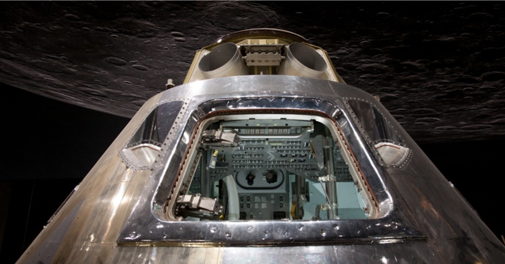

# Computere og opfindelser

<span style="color:white">

Hej, jeg hedder Ivan, er `far til Ivy og Freyja i 1b` og jeg vil gerne fortælle jer lidt om hvem der opfandt computeren og hvad den er lavet af. Her er min email hvis der er nogen der vil spørge om noget: `ivanpedersen79@gmail.com`
</span>

## Hvad er en computer?
---
<span style="color:white">

En computer er en maskine der kan mange forskellige ting. I gamle dage var deres formål at `gøre  matematik lettere.`

Måske ville de tage lang tid og være lidt kedeligt at regne hele formlen ud der starter med: 

```
(1  - 1 / 3 + 1 / 5 - 1 / 7 + 1 / 9 - 1 / 11 + 1 / 13 ) x 4
```
så en computer kan hjælpe med at finde resultatet meget hurtigere: 
`3,2837` (og eventuelt 3.14)

`Computere kan` meget andet nu, som f.eks. hælpe med at `skrive, spille spil, se videoer og tale med folk`. Moderne computere har altid været brugt til spil. Her er et af de første:


`Spacewar - MIT, Amerika, 1962`


Computere kan være `store eller små` og kan bestå af:

- Et `tastatur` og en mus for at give instruktioner. F.eks. vores lange formel ovenfor.

- En `skærm` for at vise resultatet.

- `Processor`: en meget hurtig og lille lommeregner der er "`hjernen`" der kan udregne et resultat. Den hedder også en mikrochip eller CPU. 


Computere startede som kæmpe store lommeregnere - lad os gå tilbage i tiden og møde dem der skabte computerne og brugte dem til banebrydende opfindelser.

<span style="color:black">

# Computerens historie

## **200 år siden**: Ada Lovelace, Charles Babbage og den første regnemaskine

<span style="color:white">


`Differens Maskinen`

Ada havde rigtigt mange ideer til skøre maskiner, f.eks. nogle der kunne flyve. Hendes mor ville også gerne have hun lavede sine lektier, specielt matemetik. Hun endte med at elske matematik og læste en masse om det. Derfor hørte hun om Charles Babbage, der havde `opfundet en maskine` så man kunne `regne meget hurtigere` end i hovedet og på parpir. Den hed `differens maskinen` og skulle laves af mange tons af metal og tusindvis af tandhul. Ada var fascineret brugte mange timer på at studere differens maskinen. I 1843 `opfandt Ada` ideen om at ændre funktionen af den med `specielle instruktioner` skrevet på hul-kort. Ada Lovelace var den `første computer programmør`. 

---

<span style="color:black">

## **80 år siden** - Alan Turing, Wrens og hemmelige koder

<span style="color:white">

Alan Turing var en `opfinder og matematiker`, der levede for mange år siden. Under `2. verdenskrig` arbejdede han for den britiske regering med at `læse hemmelige beskeder` fra Nazisterne der var fjenden.


Han gjorde dette ved at designe en stor maskine kaldet `Bombe`, der kunne `udføre beregninger meget hurtigere` end en person. Bombe var `så stor, at den fyldte hele et rum`, var lavet af bronzefarvet metal og havde en masse elektonik og hjul der kunen rotere.


Alan havde hjælp af mange mennesker til sit arbede omkring Bombe, deriblandt nogle specielle damer kaldet `Wrens der programmerede Bombe` for at løse koderne. De arbejdede sammen for at hjælpe regeringen med at `finde ud af, hvad fjenden havde planlagt`. Ved at bruge teknologi og deres intelligens redede de `mange tusind liv` under 2. verdenskrig. Dette var med til at vinde krigen.

---
<span style="color:black">

## 50 år siden: Magaret Hamilton og Månen
<span style="color:white">

Den Amerikanske Apollo-mission sendte de første `mennesker til Månen`. De havde en computer på størrelse med et skab. 



`Margaret Hamilton` var en datalog og `chef` for det hold der `udviklede softwaren`, som `styrede rumfartøjet` og sørgede for, at det fungerede korrekt. En dag tog hun sin datter med på arbejde og de legede astronaut. Datteren og`trykkede på alle knapperne` og hjalp med at finde en `vigtig fejl` i programmet some Margaret så `kunne reperere`. Det er stadigt meget vigtigt idag at `teste` programmer for fejl.

På grund af hendes arbejde var `missionen en success` og rumfartøjet Eagle kunne både `lande sikkert` på månen med de `3 astronauter` og få dem hjem til jorden igen. Margaret Hamilton er en af de vigtigste personer i datalogiens verden og mange af hendes `opfindelser bliver stadig brugt idag` og findes i computer programmer der skal være `sikre` som f.eks. i en `flyvemaskine`.

Her er hun med alle `programmerne` til Apollo missionen. `Hvor mange sider tror i der er?`(14.500 sider):


---
<span style="color:black">

## 2 år siden: Katie Bouman og det sorte hul.

<span style="color:white">

Katie Bouman er en datalog der arbejder med at `lave billeder på computere`. Hun gjorde det muligt for forskere at se et billede af et sort hul for første gang. `Et sort hul` er et sted i rummet, hvor tyngdekraften er så stærk, at `ingenting, ikke engang lys`, kan undslippe det. 
Her er et billede hvor hun ser resultatet af sit arbejde for første gang. `Hvordan ser hun ud?`


Katie og hendes venner `arbejde sammen med astronomer` over hele verden og samlede målinger fra rummet sit computer program. Hun fik en asteroide opkaldt efter sig, 291387 Katiebouman. 


Dette program kunne `beregne verdens første billede` af et sort hul ved at samle et slags puslespil af alle astronomernes data.


Dette var en meget vigtig opdagelse, fordi det `hjalp forskerne med at forstå` mere om sorte huller og universet.

Så der er mange mennesker der har hjulpet med til at opfine selve computeren - og andre der har opfundet programmerne der førte til nye opfindelser der har `ændret vores syn på hele universet`.
```


```

<span style="color:black">

# Hvad er en computer lavet af?

<span style="color:white">

Lad os finde ud af hvad en computer er lavet af. Det vigtigste er nok **processoren**, eller `'hjernen'` så lad os kigge på den. En processor heder også en CPU eller mikrochip. 

Der er processorer i mange ting fordi de `er blevet små,` bedre og bruger `mindre electicitet`. De er i alt fra biler til vaskemaskiner og ure og `hjælper med at løse mange problemer` som f.eks. avancerede matematiske udregninger. De samme computere kan bruges til sjove ting som f.eks. `Minecraft`. 

`Processoren` er en lille `sort firkant`. Det sorte er bare et `låg` der beskytter det der er indeni. 


Hvis vi `åbner` det sorte låg af og ser `inden i processoren` ser det lidt mere spændende ud. 


Processoren er mest `lavet af silikum skiver og kobber linier`. 

<span style="color:black">

## Hvad er silicum?

<span style="color:white">

Silicum findes i `sand`:


Det er et mineral, et `grundstof`.
Hvis vi kigger på det i et `mikroskop` kan vi se de ligner krystaller. Det er fordi der er silikum i. 
|   |   |
|---|---|
|||

<span style="color:black">

## Varme krystaller

<span style="color:white">

Specielt sand bruges til processorer og vi starter med at `smelte det`. Pas på - det er varmt! 
(ca `2000 grader` celcius!). 
Kombinationen af varmen og processen laver sandet til en `krystal`, det hedder en
*Czochralski process*.
Vi kan `lave vores egen krystal` ved at gro den med krea-kits. `Er der nogen der har prøvet det?`
Krystallen til en chip ligner lidt en pølse. Den skærer vi i `skiver`


|   |   |
|---|---|
||
||

<span style="color:black">

## Meget små kontakter

<span style="color:white">

Derefter bruger de specielle værktøjer til at skære skiven i `meget små stykker`, kaldet `transistorer`. Transistorer er som `små kontakter`, der kan tænde og slukke for strøm. Der er mange af dem i en processor - ca. `17 milliarder!` Og de er virkelig små - ca. `7 nano meter`. Det er en `million-del af en milimenter`. Et `hår er 70.000 nano meter bredt` - så der kan ligge `10.000 af deher små kontakter på tværs af et hår`.

|   |   |
|---|---|
|||

<span style="color:black">

## Elektriske veje

<span style="color:white">

Nu skal vi bruger `metallet kobber`. Kobber er god til at lede `electricitet`. Derfor er det også `indeni ledninger`.
|   |   |
|---|---|
|||

Vi bruger endnu mindre værktøjer til at `tegne kobber-linjer` på silicum'et. Disse linjer er en slags `"veje" for strøm  at rejse på`.


Designet af disse 'veje' er vigtigt for at processoren kan blive `lille`, bruge `minimalt strøm` og vise dit favourit spil `hurtigt`.

Til sidst lægger vi et `beskyttende lag` på mikrochippen der gør den ligner en sort firkant. Så er mikrochippet klar til at blive brugt i enheder som telefoner og computere.


<span style="color:white">

<span style="color:black">

# Til slut

<span style="color:white">

Det firma jeg arbejder for designer processorer. `Vores opfindelse` er et design til processorer der er så små at vi kan have en `computer i lommen` - en smartphone.  

En computer er rigtigt mange forskellige opfindelser lavet at mange `dygtige personer`. Områder som `kemi, elektronik og mekanik` har været vigtige for a bygge computeren . Programmerne der styrer computeren er ligeså vigtige og bygger på områder som `logik, sprog og matematik`. 

`Alle kan lære at skrive et computer program` ved at bruge f.eks. Scratch, Minecraft Education eller læse bøger - det vigtigste er at vi vil lære noget nyt og har `kreative ideer` til opfindelser. 

Mange opfindelser er gort ved hjælp af computere lad os tænke på hvorden vi `hjælper hinanden og vores planet` med de ting vi opfinder.


<span style="color:black">

## Mange tak! 


```
Materiale liste:

Raspberry pi
Tablet 
Sand i kolbe
Ledning / kobber
```


